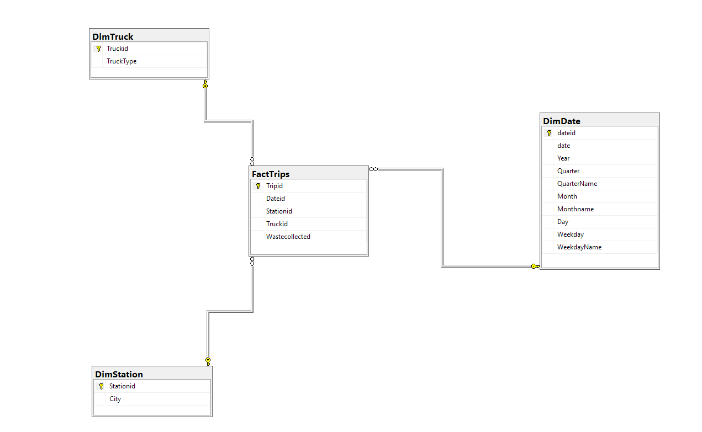

# Waste Collection Data Warehouse

A data warehouse built with Microsoft SQL Server as part of a practice assignment.
Models waste collection trips using a star schema with trucks, stations, and dates as dimensions.

## Database Diagram

## Tables

- **FactTrips** – fact table recording each waste collection trip (waste collected, date, station, truck)
- **DimTruck** – truck dimension (truck type)
- **DimStation** – station dimension (city)
- **DimDate** – date dimension (year, quarter, month, weekday)

## How to Run

1. Open SQL Server Management Studio (SSMS)
2. Run `schema.sql` to create the tables
3. Run `data.sql` to insert the sample data

## Requirements

- Microsoft SQL Server
- SSMS or any SQL Server-compatible client
